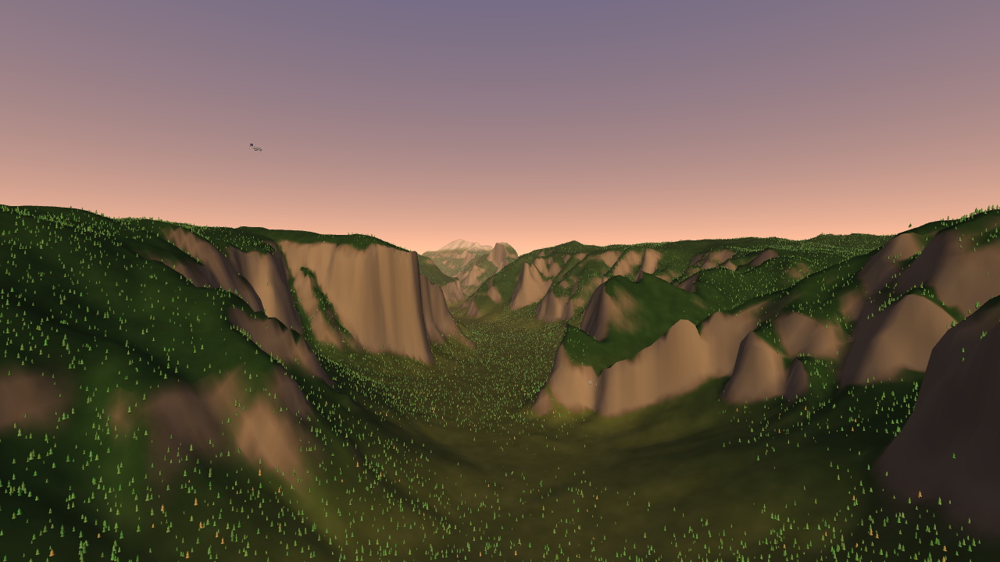

# FLIGHTOPUS — fly a to-scale Boeing 737 MAX 9 through Yosemite Valley

A browser flight sim built on real terrain. Take off into a navigable, to-scale
Yosemite Valley rebuilt from **real elevation data**, fly a fully-modelled
**Boeing 737 MAX 9** with believable aerodynamics, chase six famous waterfalls,
ride out hurricane-force winds, and leave a trail of every crash and landing
behind you for the next attempt.



## Highlights

- **Real Yosemite topography.** Elevation is pulled from AWS Terrain Tiles
  (Terrarium-encoded, derived from NASA SRTM / ASTER and USGS data), stitched
  into a height grid spanning the classic valley — **1047 m to 3027 m** of real
  relief, from the Merced floor up to Clouds Rest. El Capitan, Half Dome and the
  glacial U-valley are all where they should be.
- **Procedural land cover from the real elevation.** A custom terrain shader
  classifies every point by elevation / slope / aspect into granite cliffs,
  conifer forest, meadow, water and snow — and the same classification places a
  procedural forest of **up to 266,000 instanced conifers**.
- **The six famous waterfalls** — Yosemite, Ribbon, Bridalveil, Sentinel, Nevada
  and Vernal Falls — placed at their real coordinates on the cliff brinks, with
  an animated water shader, plunge pools and drifting mist.
- **To-scale Boeing 737 MAX 9** (42.16 m long, 35.9 m span) built from scratch:
  swept wing with split-tip winglets, two LEAP-1B nacelles with spinning fans,
  navy swept tail, lit cabin, navigation/beacon/strobe lights, and **animated
  retractable landing gear, flaps, ailerons, elevators and rudder.**
- **Real-ish flight physics.** Lift/drag from angle-of-attack with stall,
  induced drag, thrust, gravity and sideslip — all computed against the
  *relative* airflow, so wind genuinely pushes the jet around.
- **Five times of day** — Dawn, Midday, Golden Hour, Dusk, Night (with stars and
  a moon) — and **dynamic weather**: clear, cloudy, rain, snow, storm with
  hurricane-force winds and lightning, and northern-lights aurora.
- **Storm lightning that strikes the jet.** In a storm, bolts can hit the
  aircraft and damage a wing, engine, tail or the nose — degrading thrust, lift
  and control. Damage shows as a **corner airframe schematic** (the hit part
  lights up), a **red edge vignette** that intensifies and pulses as it worsens,
  scorched parts trailing smoke, and a relentless **nose-down pull** from tail
  damage that you have to fight all the way down.
- **Every attempt persists.** Crash and the burning wreckage stays. Land and the
  jet stays parked. Press Space for a fresh aircraft and fly on while your past
  runs — and their flight trails — remain in the valley.
- **Liquid-glass UI.** The HUD and homepage use a real light-bending glass
  treatment (SVG displacement + backdrop blur) for instruments and the intro.

## Controls

Pick **Cursor** (easy — the jet flies toward your cursor) or **Keyboard** on the
homepage, or press `M` to switch any time.

| Key | Action | Key | Action |
| --- | --- | --- | --- |
| **Mouse** | **Cursor mode: steer toward the reticle** | `M` | Switch cursor / keyboard |
| `W` / `↑` | Pitch up (climb) | `G` | Landing gear up / down |
| `S` / `↓` | Pitch down (dive) | `F` / `R` | Flaps extend / retract |
| `A` / `←` | Roll left | `X` | Spoilers / airbrake (hold) |
| `D` / `→` | Roll right | `B` | Wheel brakes (hold) |
| `Q` / `E` | Rudder yaw | `Space` / `⏎` | New attempt |
| `Shift` | Throttle up | `C` | Cycle camera (chase / cockpit / wing / cinematic) |
| `Ctrl` | Throttle down | `T` · `Y` | Cycle time of day · weather |
| `H` | Help | `P` | Pause |

## Run it

```bash
npm install
npm run fetch-data     # pulls the real Yosemite elevation into public/assets (optional; bundled already)
npm run dev            # http://localhost:5173
```

Build the static, shippable bundle:

```bash
npm run build          # -> dist/
npm run preview
```

The elevation grid (`public/assets/heightmap.png` + `meta.json`) is committed, so
the app works offline out of the box. Re-run `npm run fetch-data` to regenerate
it (and to attempt fetching a satellite/aerial drape, if your network allows it).

## How it self-tests

Graphics and flight were verified headlessly with a SwiftShader/Playwright
harness that boots the app, flies the jet, screenshots and reads telemetry:

```bash
npm run shot -- chase --query "skipintro=1&time=golden" --wait 6000
npm run shot -- climb --query "skipintro=1&debug=1" --keys "w:hold:4500"
```

URL params: `?q=low|med|high|ultra`, `?time=dawn|day|golden|dusk|night`,
`?weather=clear|cloudy|rain|snow|storm|aurora`, `?skipintro=1`, `?debug=1`,
`?cam=top|tunnel|floor|falls` (inspection views).

## A note on the data

The **elevation is real** (AWS Terrain Tiles). Satellite/aerial imagery tiles
were unreachable from the sandboxed build network (the allow-list only exposes a
few hosts), so the *colouring* of the world is derived procedurally from the real
elevation — granite on the steep faces, forest and meadow at mid elevations,
snow up high — rather than draped photography. Drop a `satellite.jpg` next to
`heightmap.png` (same bbox, see `scripts/fetch-data.mjs`) and the pipeline is
ready to use it.

## Tech

Vanilla [three.js](https://threejs.org) + Vite, custom GLSL for the terrain,
sky, clouds, water, aurora and tree sway, a hand-written flight model, and CSS /
SVG liquid-glass UI. No game engine.
